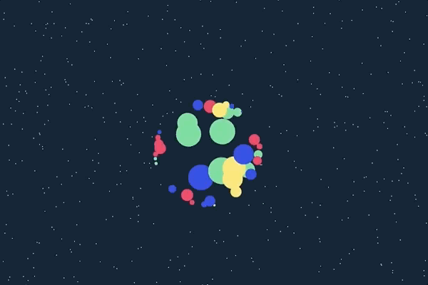

# Pts

   

Pts is a typescript/javascript library for visualization and creative-coding. 

**Get started at [ptsjs.org](https://ptsjs.org)**.

Please give it a try, [file issues](https://github.com/williamngan/pts/issues), and send feedbacks to [@williamngan](https://twitter.com/williamngan). Thank you!

---    

### Usage

**Option 1**   
Get the latest `pts.js` or `pts.min.js` (in [dist](https://github.com/williamngan/pts/tree/master/dist) folder). Alternatively use a CDN service like [cdnjs](https://cdnjs.com/libraries/pts) or [jsdelivr](https://cdn.jsdelivr.net/gh/williamngan/pts/dist/pts.min.js) or [unpkg](https://unpkg.com/pts/dist/pts.min.js). Then add it to your html page like this:
```html
<script type="text/javascript" src="path/to/pts.js"></script>
```
Pts is pretty lightweight. Currently at ~100kb minified and 30kb gzipped.


**Option 2:**   
Install via `npm install pts`. Then you can choose to import some parts of Pts into your project as needed. 
```js
import {CanvasSpace, Pt, Group, Line} from 'pts';
```

To quickly get started, try download or clone these repos:
- [pts-starter-kit](https://github.com/williamngan/pts-starter-kit): Get started with a sample app using npm and webpack
- [pts-react-example](https://github.com/williamngan/pts-react-example): Try an example of using Pts with React.
- [react-pts-canvas](https://www.npmjs.com/package/react-pts-canvas): Use it in your React project by extending react-pts-canvas component

**Get Started**   
Read the [guides](https://ptsjs.org/guide/get-started-0100) and take a look at the [demos](https://ptsjs.org/demo/?name=circle.intersectCircle2D) and their source code.    
If you need help, please don't hesitate to [file an issue](https://github.com/williamngan/pts/issues).

---    

### For development

Pts is written in typescript. You can clone or fork this project and build it as follows:

#### Build and test

Clone this repo and install dependencies via `npm install`.

```bash
npm start
npm run build
npm test
```

#### Generate documentations
Run this to generate Pts styled documentations. (Requires python 3.6)
```bash
npm run docs 
```

If you prefer to generate default typedocs, run this:
```bash
typedoc --readme none --out typedocs src --name Pts
```

---

### Contributing

We appreciate your support and feedbacks!

Please file issues if you find bugs and have feature requests. If you are able to send small PRs to improve Pts or fix bugs, that would be awesome too. 

For larger PRs, please ping [@williamngan](https://twitter.com/williamngan) to discuss first.

---    

### License
Apache License 2.0. See LICENSE file for details.   
Copyright © 2017-2019 by William Ngan and contributors.

