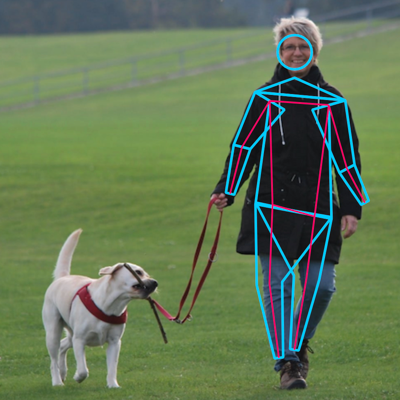
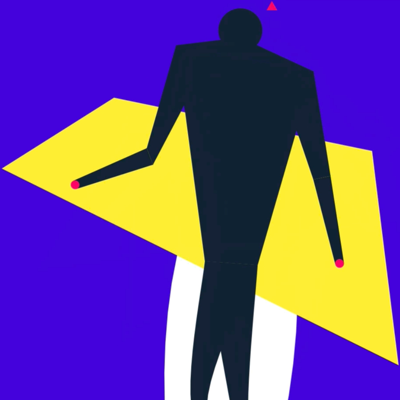
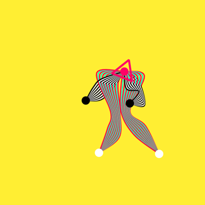

# Visualizing Pose with Pts and tensorflow.js

Demos using [Pts](https://ptsjs.org) to draw poses estimated by [tensorflow.js](https://js.tensorflow.org/)'s [PoseNet](https://medium.com/tensorflow/real-time-human-pose-estimation-in-the-browser-with-tensorflow-js-7dd0bc881cd5). It includes a [BodyPose](./js/bodypose.js) class which helps you manage and visualize the key points. This is still very much in a hacky prototype form, so please enjoy the ride :)

### Demos

- `a.html` is a simple demo that visualize an estimated pose from a static image. ([source code](./a.html))

  

- [`b.html`](./b.html) demonstrates how to take a webcam input, get the pose estimation, and draw the pose in an expressive way. ([source code](./b.html)) Inspired by Matisse's paper cut-outs. You can also try a [live version here](https://ptsjs.org/demo/more/tfjs_posenet/b.html) (experimental, require webcam access).

  

- [`c.html`](./c.html) is similar to "b" but using a video file. Inspired by Oskar Schlemmer's Triadic Ballet. ([source code](./c.html))

  

### Quick Start

#### Preparing input
You can use a video or an image -- square size works best. There's no need to normalize the bitmap data, and in `bodypose.js` there are a few helper functions to make the process easier: for example, call `webcam` function to connect to webcam, and call `BodyPose.squareBuffer` function to take a square crop of your input.

#### Data structure
PoseNet returns json data in this structure: 

```
{
  score,
  keypoints: [ { position: { x, y }, score }, ... ]
}
```

You can pass the raw data into `BodyPose.update` function, and then get the key points by names directly. The keys are:   

```
nose, leftEye, rightEye, leftEar, rightEar,     
leftShoulder, rightShoulder, leftElbow, rightElbow, leftWrist, rightWrist,    
leftHip, rightHip, leftKnee, rightKnee, leftAnkle, rightAnkle
```

### Drawing
The `BodyPose` class offers a number of convenient functions for visualizing the pose. Let's take a quick look.

First, you can take one or more pose key points like the following. (Here `body` is an instance of a `BodyPose`.)

- `body.at( "leftShoulder" )` : get the current left shoulder point
- `body.take( ["leftShoulder", "leftElbow", "leftWrist"] )` : get an array of 3 key points
- `body.joint( "leftShoulder", 20 )` : get the left shoulder point as a 20px radius circle for drawing.

Similary to `joint`, you can get a part of the body in various thickness. For example:

- `body.body( 40, 10 )` : get a torso with shoulder scale of 40, and hip scale of 10
- `body.arm( "left", 20, 10, 5 )` : get a left arm with shoulder scale of 20, elbow of 10, and wrist of 5

Finally, you can get a wireframe of the whole body with `body.wireframe()`. This returns groups of lines which you can then draw using `form.line(...)` function. 


### And more
The `BodyPose` should be general enough to support drawing poses from other libraries. For example, you can probably run a PyTorch pose model in python, send the raw data through websockets (eg, with SocketIO), and visualize the pose in the browser.

If you have suggestions for improvements, please file an issue or ping @williamngan on twitter. Thanks!


## Photo / Video credits
- Photo used in "a" demo from CC licensed photo at pexels.com/photo/animal-canine-dog-grass-220968
- Video used in "c" demo from CC licensed video at https://www.youtube.com/watch?v=gADY77Jy2-Q